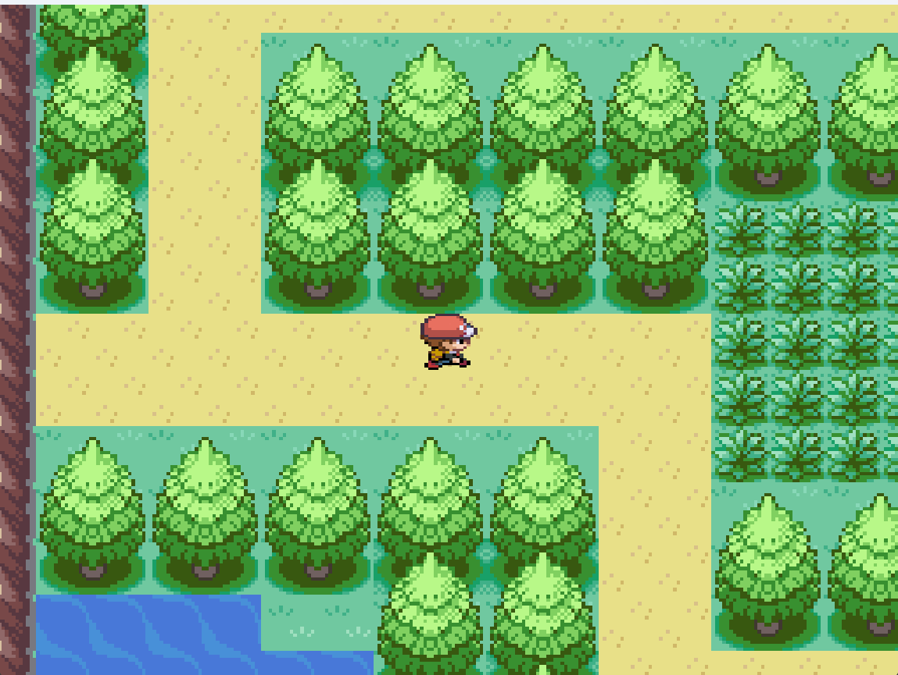
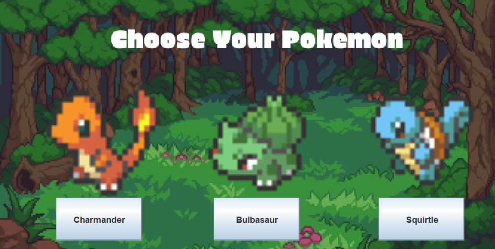
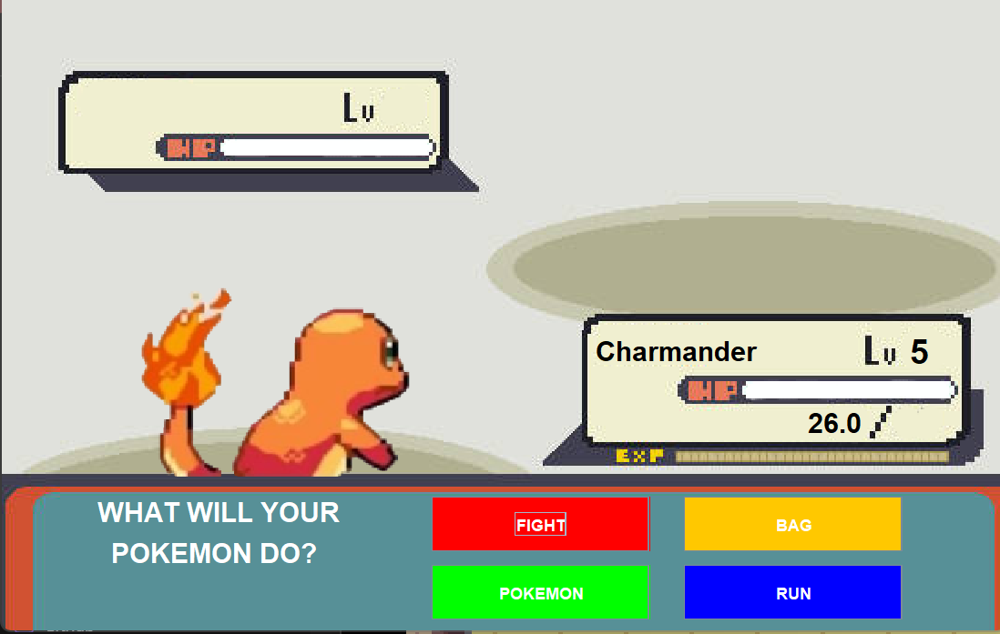

# 🎮pokemon-style-rpg
A pokemon-style rpg Java game that utilizes tile-based map system, player movement, battle mechanics, and interactive locations such as a store and heal center.

# 🧩 Features
- 🗺️ Tile-Based world map
  - Tile rendering
  - Grid based movement
  - Collision detection
- ⚔️ Battle System (Work in progress)
  - Pokemon encounters 
  - Turn based combat mechanics
  - Damage Calculation
- 🐉Pokemon Selection
  - Choose one of three starter pokemon
  - Pokemon gets stored in party
- 🏬 Interactive Locations
  - Poke Center to heal pokemon
  - Poke store to buy items
- 🕹️ Player movement
  - WASD movement
  - NPC interaction

# 🔧 Techniques used
- Java
- Java swing/AWT
- Object-oriented programming
- Tile-based game engine
- Custom sprite rendering


# 📂 Program Structure
```
src/
 ├── map/
 │   ├── CollisionChecker.java
 │   ├── Dialogue.java
 │   ├── GamePanel.java
 │   ├── KeyHandler.java
 │   ├── MenuScreen.java
 │   ├── PokemonBattle.java
 │   ├── PokemonCentre.java
 │   ├── PokemonStats.java
 │   ├── StarterPokemon.java
 │   ├── Store.java
 │   └── Main.java
 │
 ├── entity/
 │   ├── Entity.java
 │   ├── PlayerPokemon.java
 │   ├── Pokemon.java
 │   └── Player.java
 │
 └── tile/
     ├── TileManager.java
     └── Tile.txt

```
# 🧠 What I learned
- How to build a game using a tile-based system
- Implement collision detection
- Manage Game states and player interaction
- Design object-oreitned programs

# 🚀 Future Improvements
- Add more typing, moves, and pokemon.
- Improve damage system to include type advantages, weakness, accuracy, PP, and terrain advantages.
- Add battle animations
- Add Inventory Systems to manage all items
- Implement a save and load file system
- Expand map

## Screenshots
# World Exploration 


# Starter Selection


# Battle System (WIP)


# 👨‍💻 Programmer 
Darsh Patel
Software Engineering Student - Western University
